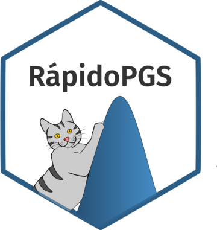

# RápidoPGS <a href='https://grealesm.github.io/RapidoPGS/'></a>

<!-- badges: start -->

[](https://cran.r-project.org/package=RapidoPGS)
<!-- badges: end -->

**A *rápido* and lightweight method to compute Polygenic Risk Scores.**

**Last update:** 2023-10-12

**Current version:** 2.3.0

This package allows to quickly (*rápido* is Spanish for "fast") compute polygenic scores (PGS) from case-control or quantitative trait GWAS summary statistic datasets, without the need of an external validation dataset.

# Background

You can find a description of the ideas behind RápidoPGS, as well as technical details in our *Bioinformatics* paper:

> [Reales G, Vigorito E, Kelemen M, & Wallace C (2021) RápidoPGS: A rapid polygenic score calculator for summary GWAS data without validation dataset. *Bioinformatics*, 37(23), 4444-50.](https://academic.oup.com/bioinformatics/article/37/23/4444/6305825)

# News

* In version 2.3.0, we updated the `rapidopgs_multi()` and `gwascat.download()` functions. For  `rapidopgs_multi()`, we udpated it to accomodate changes on [susieR](https://github.com/stephenslab/susieR). Now sample size is required for all files, and the `pi_i` argument has been deprecated. We also opened the possibility to apply RápidoPGS to non-European ancestries. For `gwascat.download()`, we updated the method, which wasn't working anymore to extract data from GWAS catalog. It now works interactively, providing the users advice on which file to choose. We also updated the hg38 LD blocks file, as it was updated in its original repository.
* In version 2.2.0, we updated hg38 LD blocks from liftovered Berisa & Pickrell to recomputed MacDonald et al. 2022 (https://github.com/jmacdon/LDblocks_GRCh38, https://www.biorxiv.org/content/10.1101/2022.03.04.483057v1).
* In development version 2.1.0.9009 we fixed a bug derived from automatically supplying "nref" to SuSIE in `rapidopgs_multi()`, which is no longer required.
* In development version 2.1.0.9008 we fixed a change in the hard-coded url to download 1000G panel from the official server to meet a change in versioning (v5a -> v5b) at the source.
* In development version 2.1.0.9007 we fixed a bug caused by changes in behavior of `runsusie()` in `rapidopgs_multi()` that used to supply an extra zero element which is not supplied anymore.
* In development version 2.1.0.9006 we fixed an error popping up when `rapidopgs_multi()` is not supplied input of data.table class, and removed a deprecated argument in `runsusie()` internal function that was preventing `rapidopgs_multi()` to run properly.
* In development version 2.1.0.9005 we fixed a change in the hard-coded url to download 1000G panel from the official server to meet a change in versioning for sex chromosomes at the source.
* In version 2.1.0 we added a functionality to `rapidopgs_multi()`, which now allows users to use their own LD matrices instead of computing them on the go from a reference panel. For European datasets, we recommend downloading UK Biobank LD matrices kindly provided by Privé et al., which can be accessed [here](https://figshare.com/articles/dataset/European_LD_reference/13034123).


# Installation

RápidoPGS (2.2.0) is now available on CRAN. You can install it by typing the code below.
```
install.packages("RapidoPGS")
```

## Development version

There's also a development version, that can be installed from GitHub.
```
library(remotes)
install_github('GRealesM/RapidoPGS')
```

### A note on dependencies

RápidoPGS has some dependencies that aren't available directly from CRAN, so must be installed a bit differently.

**GenomicRanges**

`GenomicRanges` package is a Bioconductor package. Please type:
```
if (!requireNamespace("BiocManager", quietly = TRUE))
    install.packages("BiocManager")

BiocManager::install("GenomicRanges")
```


# Documentation

Full documentation and vignettes are available on the website (click on the cat if you're at the GitHub repo).


